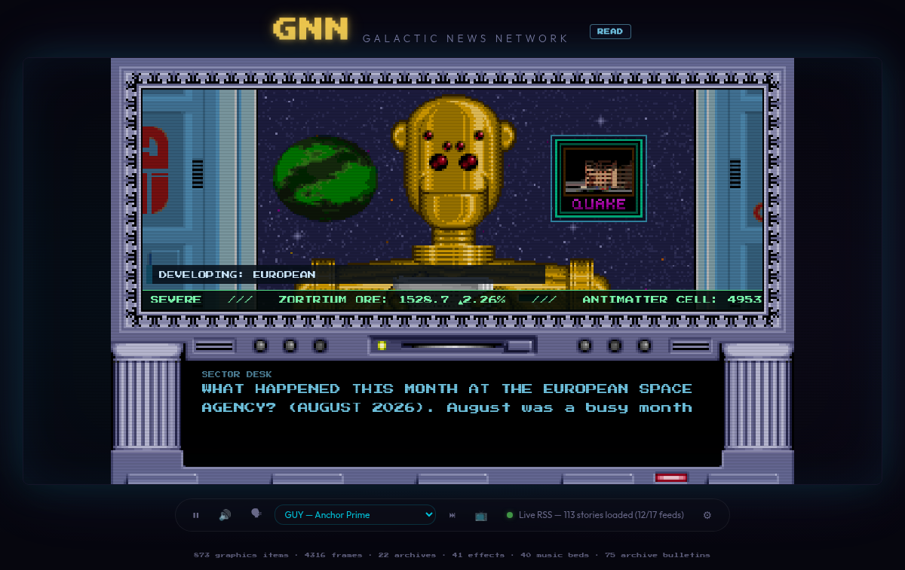
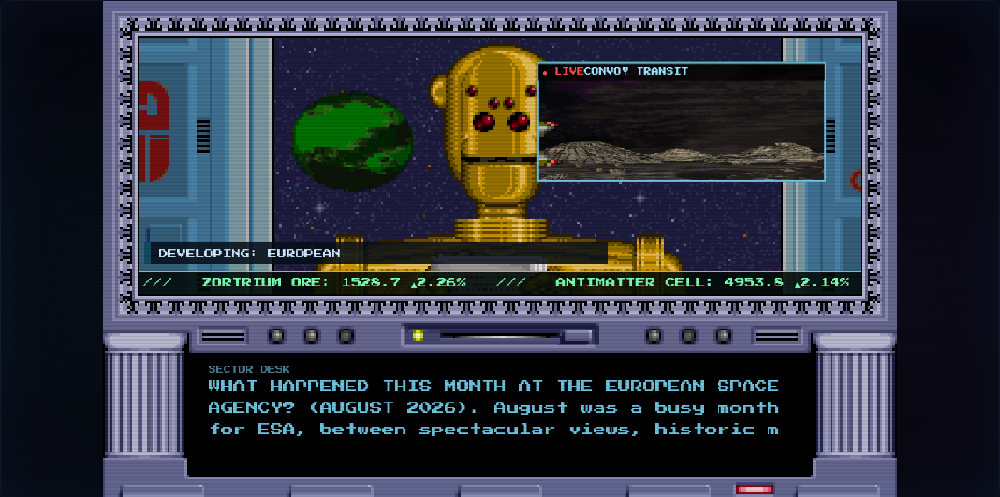
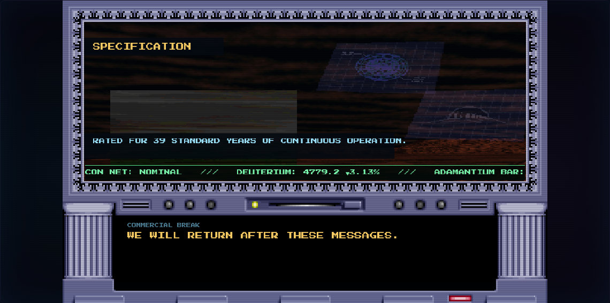
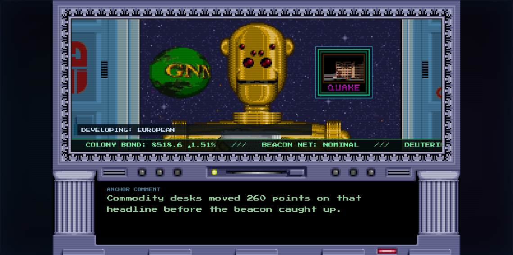
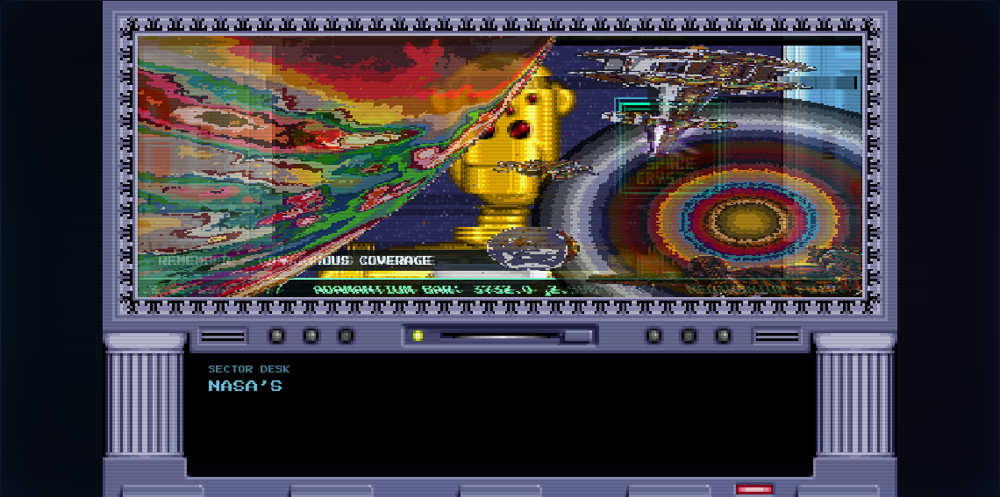
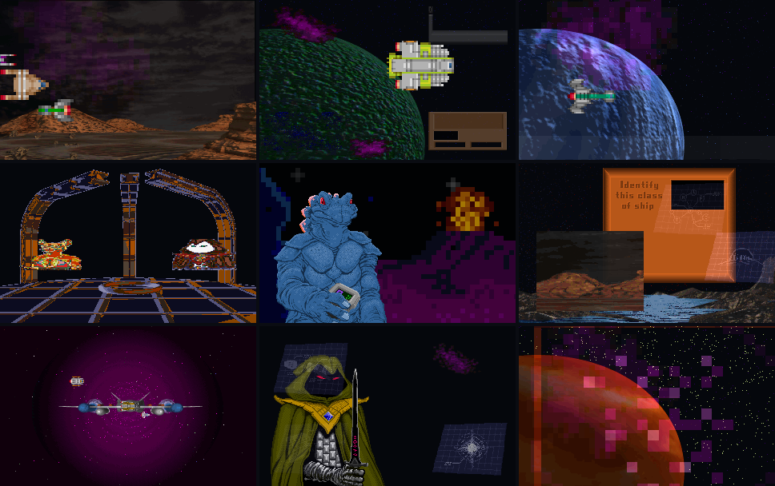
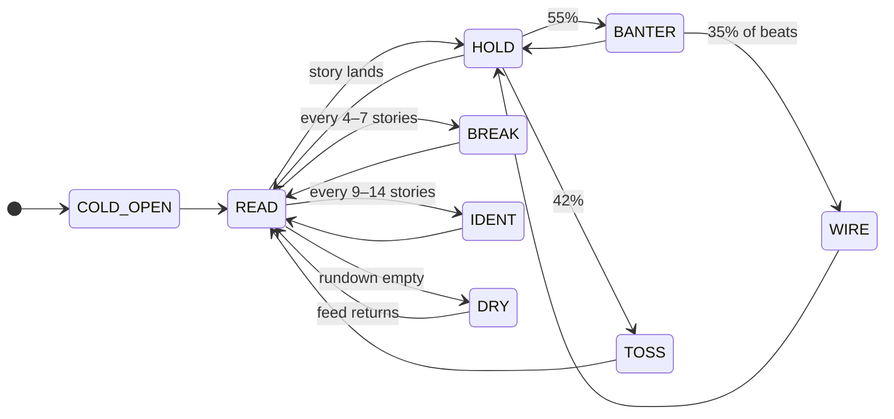

<div align="center">

# GNN — Galactic News Network

**An unscripted live newscast simulation.**
Real-world RSS, read by the *Master of Orion 1* robot anchor,
on a channel built entirely out of that game's 1993 asset library.

[](#)
[](#)
[](#)
[](#)
[](#)
[-ff9de2?style=flat-square)](#)



</div>

---

## Contents

- [What this is](#what-this-is)
- [Screenshots](#screenshots)
- [Quickstart](#quickstart)
- [How the broadcast is paced](#how-the-broadcast-is-paced)
- [Features](#features)
- [Controls](#controls)
- [Architecture](#architecture)
- [The asset pipeline](#the-asset-pipeline)
- [Verifying and rebuilding](#verifying-and-rebuilding)
- [Credits](#credits)
- [Legal](#legal)

---

## What this is

Most "retro news ticker" toys read a feed in a loop. This is a **channel**.

It has a rundown. It has dead air. The anchor finishes a story, lets it sit,
adds a line of his own, and throws to the next item. Every few stories the desk
goes away entirely for a commercial break that was storyboarded and voiced at
runtime. The transmitter fails on a schedule nobody published.

Everything you see and hear was decoded out of the original `.LBX` archives:
**873 graphics items, 4,316 frames, 41 sound effects, 40 music tracks and the
154 news bulletins the original in-game anchor read**. Nothing is drawn,
sampled or composed from outside the game — including the freighter convoys and
tactical plots, which are *composited at runtime* out of parts the game shipped
separately.

The game data itself is **not** in this repository, and is not needed to run
it. See [Legal](#legal).

---

## Screenshots

| Live B-roll cutaway | Commercial break |
| :---: | :---: |
|  |  |
| A convoy shot assembled from a `LANDING` skyline, four `SHIPS2` hulls on independent depth tracks and a `NEBULA` wash. | A storyboarded 4–6 shot sequence with generated copy, voiced by the same anchor. |

| Anchor commentary | Transmission fault |
| :---: | :---: |
|  |  |
| Between headlines the anchor comments, or reads a re-pointed 1993 sector-wire bulletin. | Eight fault types seize the lip matrix, the globe, the audio bus and the picture. |

<div align="center">

<br><em>Nine scene recipes, each assembled from a different set of source items.</em>
</div>

---

## Quickstart

```bash
git clone https://github.com/Ekco-S64QTN6/GNN.git
cd GNN

pip install edge-tts          # optional — without it the browser voice is used
./start.sh                    # http://localhost:8080   (Ctrl-C stops it)
```

Open <http://localhost:8080> and **click once anywhere** — browsers require a
gesture before any page may make sound.

### Going off air

```bash
./start.sh --bg     # run detached, logging to gnn-server.log
./stop.sh           # stop the server and anything the test harness left running
```

`stop.sh` shuts down the server by PID file, catches any stray one still
holding the port, and closes headless browsers the test harness started. It
matches those on the harness's own debugging port **and** on the process really
being a browser, so your own Chromium is never a target. `Ctrl-C` on a
foreground `start.sh` does the same thing — the server traps `SIGINT`/`SIGTERM`,
closes the listener and removes its PID file.

### Checking the install

```bash
curl localhost:8080/api/status      # what the station has available
python3 tools/verify_assets.py      # prove every asset resolves locally
```

**Requirements:** Python 3.8+ and a modern browser. No build step, no bundler,
no `node_modules`, no external services at runtime. `edge-tts` is the only
optional dependency; the app falls back to the Web Speech API without it.

---

## How the broadcast is paced

This is the part that makes it feel like television rather than a feed reader.
The rundown is generated as it plays — it is not a loop.



| Segment | What actually happens |
| :--- | :--- |
| **READ** | A live RSS story. The teleprompter types at whatever rate lands the last character as the voice stops. A B-roll cutaway fires a third of the way in. |
| **HOLD** | **Real dead air.** Voice silent, prompter holding the last line, the anchor's mouth shut, room tone carrying it. 1.5–3.6 s. This is the single biggest difference between a page reading RSS and a channel that is on. |
| **BANTER** | Standalone commentary generated for the story just read — a robot aside, an analyst line, a filing note. |
| **WIRE** | One of the **actual 154 `EVENTMSG.LBX` bulletins** the original GNN anchor read, with its placeholders re-pointed at proper nouns and figures mined out of the live story. |
| **TOSS** | The one-line handoff into the next item. |
| **BREAK** | A full commercial sequence — see below. |
| **IDENT** | Station identification. |
| **DRY** | The feed went quiet. The anchor notices, and says so. |

Breaking-news keywords pre-empt the rundown, sound the klaxon and flash the
CRT border.

---

## Features

<details open>
<summary><b>Pixel-perfect VGA studio</b></summary>

- 320×200 6-bit VGA source rendered at 3× (960×600), nearest-neighbour, with
  CRT scanlines and glow.
- 25-frame robot anchor, 25-cel holographic globe, 22 over-the-shoulder icons.
- Everything inside the studio monitor is drawn to a **single viewport buffer**
  before being blitted, so faults roll, tear and desaturate the whole signal at
  once — the way a failing CRT would — rather than per element.

</details>

<details open>
<summary><b>Waveform lip-sync</b></summary>

The mouth used to flap on a random timer. Now an `AnalyserNode` taps the voice
bus, and the anchor's 25 cels — bucketed into five visemes by jaw opening — are
selected by the live low-frequency energy of the speech. Louder syllables hold
longer. During dead air he blinks.

</details>

<details open>
<summary><b>Zero-cloud neural voice</b></summary>

A local `/api/tts` endpoint drives Microsoft neural voices through `edge-tts`.
Nine voice models, switchable live, with pitch and rate shaped for a broadcast
robot. No account, no API key. If the endpoint is missing the client silently
falls back to the Web Speech API, and a watchdog guarantees the rundown keeps
moving even if audio stalls entirely.

</details>

<details open>
<summary><b>Synthesized B-roll</b></summary>

*Master of Orion* never shipped a shot of a freighter convoy crossing a colony
skyline at dusk. It shipped the skyline (`LANDING`), the freighter (`SHIPS2`),
the nebula wash (`NEBULA`) and the tactical readout plates (`STARMAP`). This
builds the shot.

Nine recipes — `convoy · tactical · survey · council · interview · industry ·
anomaly · cyber · deepfield` — layer backdrops, sprites and HUD chrome on a
320×200 buffer with independent per-layer motion models (`cross`, `orbit`,
`approach`, `drift`, `pulse`, `scanline`) and depth-scaled parallax. Routing is
driven by the story's own keywords. Two runs of the same recipe never look
alike.

This is what puts the "tiny tactical icons" and "blank UI screens" that earlier
passes threw away back on air as the moving parts of original footage.

</details>

<details open>
<summary><b>Commercial breaks, not bumpers</b></summary>

A break is a storyboarded 4–6 shot sequence — station ident, hook, product
hero, spec plate, tag card, legal card — each shot with its own composited
scene, its own voice-over beat read by the same anchor, its own sound design,
and a hard cut or a dissolve between them. Sponsor names, product names,
taglines and legal disclaimers are generated from the game's own vocabulary of
118 hull classes, 39 star names and 10 races.

> *Draconis Cybernetics presents the Annihilator-Class programme.*
> *Rated for 26 standard years of continuous operation.*
> *Draconis Cybernetics. Built for the long dark.*
> <sub>Warranty ends at the terminator line.</sub>

</details>

<details open>
<summary><b>The full audio bank</b></summary>

All 41 `SOUNDFX.LBX` effects are profiled offline by duration, spectral
brightness, attack and sustain, then bucketed into 13 roles — `click blip tick
thud beep chirp zap servo sweep blast siren alarm drone rumble` — so the
director asks for *a kind of noise*, not an index. All 40 `MUSIC.LBX` tracks
(21m36s) are rendered to OGG and used as break beds, ducked under the voice.

The graph is a real console: separate SFX, music and voice buses into a
station bus, through a bit-crush glitch stage, into a master compressor.

</details>

<details open>
<summary><b>Anomalies and easter eggs</b></summary>

Eight scheduled fault types — `carrier_drop · lipsync_desync · globe_reverse ·
palette_burn · tape_stop · ghost_signal · interference · vertical_hold ·
eye_flicker` — seize the anchor's lip matrix, run the globe backwards or stall
it on a single cel, bit-crush the audio bus, drag the music like a dying tape
transport, roll and tear the picture, and punch frames of otherwise-unusable
artwork into the composite.

The secrets are undocumented on purpose. The globe rewards persistence, the
anchor's optics reward curiosity, the keyboard remembers 1986, and the top of
the hour always sounds different.

</details>

---

## Controls

| Control | Description |
| :---: | :--- |
| **▶ / ⏸** | Run or hold the broadcast |
| **🔊 / 🔇** | Station audio |
| **🗣 / 🤐** | The anchor's neural voice |
| **Voice ▾** | Nine neural voice models, switchable mid-sentence |
| **⏭** | Next item on the rundown |
| **📺** | Go to a commercial break now |
| **⚙** | Inject a breaking bulletin, manage RSS feeds, toggle the crawl |
| **Canvas** | The globe and the anchor's optics are clickable |
| **Keyboard** | Listening. |

A live telemetry line under the console reports the current segment, rundown
depth, stories read, stories until the next break and any active fault.

---

## Architecture

No framework, no build step. Fifteen plain-script modules, each with one job.

```
js/
├── asset-registry.js      manifest queries — nothing else hard-codes a path
├── audio-engine.js        sfx/music/voice buses, ducking, glitch DSP
├── tts.js                 neural voice client + lip-sync analyser
├── script-writer.js       banter, wire riffs, ad copy, ticker, chyrons
├── scene-compositor.js    layered B-roll synthesis (9 recipes, 7 motion models)
├── cutscene-manager.js    cutaways + the commercial break sequencer
├── broadcast-director.js  the rundown state machine — owns the clock
├── text-engine.js         teleprompter + lower-third chyron
├── glitch-engine.js       anomalies + easter eggs
├── animator.js            viseme lip-sync + globe cel control
├── ticker-manager.js      seamless commodity crawl
├── icon-manager.js        over-the-shoulder icon matcher
├── feed-manager.js        RSS ingestion, sanitising, importance scoring
├── renderer.js            viewport buffer, layer stack, CRT post-processing
└── main.js                bootstrap, UI wiring, frame loop
```

**Layer stack.** Layers 2–7 are composited into an offscreen viewport buffer,
post-processed as one signal, then blitted into the studio frame:

```
1  studio frame                         ─┐
2  anchor                                │  drawn to the
3  holographic globe                     │  viewport buffer,
4  over-the-shoulder icon plate          │  then rolled / torn /
5  cutaway or commercial break           │  desaturated / ghosted
6  chyron lower third                    │  as one picture
7  commodity crawl                      ─┘
8  alert border + glitch artefacts
9  console readout (outside the monitor)
```

**The one rule:** no module outside `asset-registry.js` may name an asset path.
Everything asks the registry for *a kind of thing* — "a clean bright backdrop
wider than 140px", "four readout plates bigger than a button", "an alarm longer
than a second". That is what makes the whole 873-item library reachable instead
of the handful of hard-coded items earlier passes could use.

---

## The asset pipeline

`tools/lbx.py` is an original implementation of the LBX container, the LBXGFX
item header, the per-column run encoding and the embedded VGA palette block.
**All 4,316 frames across 22 archives decode byte-exact** — every frame body is
consumed to its last byte, and all 872,024 runs land inside their column.

```
u8 kind (1 = keyframe, 0 = delta over the previous frame)
  per column:
    0xFF                        column unchanged
    u8 mode | u8 seglen         seglen bytes of run data follow

    inside those seglen bytes, repeated until they run out:
      u8 pixcount | u8 skip | pixcount bytes of payload
        skip = transparent rows before this run, measured from the END of the
               previous run in this column — a gap, not an absolute y
        mode 0x80 = RLE  (v ≥ 0xE0 → v−0xDF copies of the next byte, max 32)
        mode 0x00 = raw
```

Three things earlier extractions got wrong, and this fixes:

| | Was | Is |
| :--- | :--- | :--- |
| **Column structure** | one run per column | a column is a *sequence* of runs — 60% of the library has two or more, up to 12. Reading only the first smeared it down the rest of the column, which is where the vertical streaking came from. |
| **Run offset** | absolute `y` | a **gap from the end of the previous run**. Read as absolute, every multi-run column collapses toward the top of the image. |
| **6-bit → 8-bit colour** | inconsistent — most archives wrote the raw 6-bit value (**4× too dark**), a few used `c<<2` or `c×255/63` | `(c << 2) \| (c >> 4)`, the bit replication a VGA DAC performs, so 63 reaches a true 255 |

Both structural bugs are invisible on solid artwork: the 25-cel anchor and the
22 story icons are one run per column, so they decoded perfectly either way,
and a spot check against them passed while planets, consoles and cinematics
were quietly wrong. What settles it is the studio chassis — `NEWSCAST.LBX`
item 0 is `background_tv.png`, so it can be diffed directly. Absolute offsets
reproduce **60.1%** of its pixels; gap offsets reproduce **100%** of them —
every one of the 64,000 pixels resolves to a consistent palette index. The
anchor cels, globe cels and story icons all come back at 100% shape agreement
with the artwork the project already shipped, differing only by ≤3/255 per
channel where the old pipeline's colour ramp disagreed with itself.

Because the plates the page loads are decoded by this same pipeline
(`extract_all.py` writes `background_tv.png`, the 25 anchor cels, the 25 globe
cels and the 22 icons alongside the cutscene library), the whole project now
has one colour ramp instead of three.

Each item is measured and given a `role` (`fullscreen · panel · portrait ·
sprite · chrome · strip · blank`) plus `coverage`, `lum`, `colors`, a `hero`
frame index and a `noise` score. That metadata is the whole reason the engine
can use the library safely.

> **On the scrambled items.** A handful of items were authored against screen
> palettes that live in the game executable, not in any archive. They decode
> structurally correct but chromatically scrambled. They are not discarded —
> the manifest scores them, the compositor keeps them out of ordinary footage,
> and `glitch-engine.js` uses them deliberately as transmission interference.

Full format notes and the manifest schema: **[`assets/README.md`](assets/README.md)**.

---

## Verifying and rebuilding

The app ships with `assets/` fully populated and needs nothing else:

```bash
python3 tools/verify_assets.py
# graphics : 873 items, 1382 spot-checked frames, 418 gifs
# audio    : 41 effects, 5 stings, 40 music beds
# text     : 75 bulletins, 60 leaders, 6 vocab groups
# checked  : 2048 paths
# OK — every runtime asset resolves inside the project.
```

To regenerate `assets/` you need your own copy of the game placed at
`Master of Orion 1/data/` (see [Legal](#legal)):

```bash
python3 tools/extract_all.py     # 22 archives → RGBA frames, GIFs, gfx-manifest   (~19s)
python3 tools/build_audio.py     # SFX profiling + MIDI→OGG, audio-manifest        (~30s)
python3 tools/extract_text.py    # EVENTMSG / NAMES / HELP / ORION.EXE → moo-strings
```

`build_audio.py` needs `fluidsynth`, `ffmpeg` and a General MIDI soundfont.

There is also a headless test harness that drives the newscast over the Chrome
DevTools Protocol, samples the director's telemetry and screenshots each
segment as it happens:

```bash
python3 tools/drive.py 120 .shot
#   3s COLD_OPEN  q=59  read=0
#  27s READ       q=58  read=1  prompt= 34%/271
#  49s HOLD       q=58  read=1
#  51s BANTER     q=58  read=1
#  ...
# states seen: {'READ': 161, 'HOLD': 33, 'BANTER': 30, 'WIRE': 24, 'TOSS': 12, 'BREAK': 23}
# console errors: 0, exceptions: 0
```

The harness closes its browser over CDP and waits for every helper process to
be reaped before returning, so repeated runs cannot pile up orphaned Chromium
instances. `tools/capture_docs.py` uses the same harness to regenerate the
screenshots in `docs/`.

---

## Credits

- ***Master of Orion*** (1993) — SimTex / MicroProse. All artwork, sound effects
  and music originate there.
- **Speech** — Microsoft neural voices via [`edge-tts`](https://github.com/rany2/edge-tts).
- **Music rendering** — FluidSynth with the FluidR3 GM soundfont.
- **Type** — *Press Start 2P* and *Outfit* via Google Fonts.
- **RSS** — Ars Technica, NASA, ESA, Spaceflight Now, Space.com, BBC,
  Al Jazeera, MIT Technology Review, Nature, Hacker News and others.

---

## Legal

**This is a non-commercial portfolio project. No copyright infringement is
intended.**

*Master of Orion* is a trademark of its respective owners; the game, its
artwork, its music and its sound effects are © 1993 SimTex Software and
MicroProse Software, and all rights in them remain with their current holders.
This project is not affiliated with, authorised by, endorsed by or sponsored by
SimTex, MicroProse, Atari, Wargaming, or any successor rights holder.

**No game data is distributed here in original form, and the game's `.LBX`
archives are not included in this repository.** The tools in `tools/` are
clean-room format readers written to interoperate with a copy of the game you
already own; running them requires you to supply your own legally obtained copy
of *Master of Orion 1* (it is sold on GOG and Steam). The derived material under
`assets/` exists only to demonstrate the rendering, pacing and compositing
engine, and is used here in what the author believes to be a transformative,
non-commercial, educational manner.

If you represent a rights holder and would prefer any part of this repository
be taken down, please open an issue and it will be removed promptly.

Third-party names, marks and feed content referenced by the live RSS layer
belong to their respective owners and appear only as transient news data.

The **original code** in this repository — the engine, the extractors, the
broadcast director and the compositor — is released under the MIT License.
